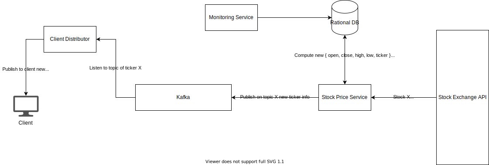

## Info

1. Will be used by up to 1,000 clients
2. We need to design the client-facing service that provides stock information - open, close, high and low
3. We have all the data and can store it however we want
4. We are responsible for development, rollout, monitoring and maintenance of the feed.
5. We can use any technology we wish.

## Solution

1. The data has the following fields: `{ open, close, high, low, date, ticker }`
2. The data should be updated without reloading the page (live updates), with 1 second intervals
3. At a given time a client requesting only a single ticker information

### Design

