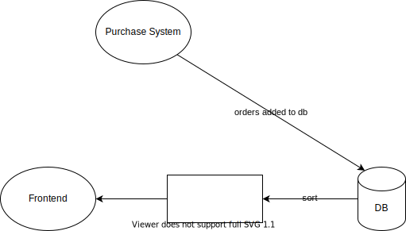

## Info

1. We need to list the best-selling products _overall and by category_
2. One product may be #1023 overall but #24 in his own category

## Solution

### Step 1: Scope the Problem

1. We only to handle the analytics part of the system
2. We should ask the interviewer what "sales rank" exactly means
3. Each product can be in a multiple categories

### Step 2: Make Reasonable Assumptions

1. Assume the stats doesn't need to be 100% up to date
2. Accuracy is important for the most popular items, but a small degree of error is okay for lower listed items
3. The data should be updated every hour

### Step 3: Draw the Major Components

### Step 4: Identify the Key Issues

In the naive system we periodically query the db to the number of sales in the past week for each product, which will be fairly expensive.

Our db just needs to track the total sales. Instead of listing every purchase in our db, we'll store just the sales from the last week.

| Prod ID | Sun | Mon | Tues | Wed | Thurs | Fri | Sat |
| ------- | --- | --- | ---- | --- | ----- | --- | --- |
|         |     |     |      |     |       |     |     |

This will act as a _circular array_. Each day we'll be clearing the corresponding day of the week.

We'll also need a table to store the associations of product IDs and categories

| Prod ID | Category ID |
| ------- | ----------- |
|         |             |

To get the sales rank per category we'll need to join these tables

We can reduce db writes by saving sales data in memory and batch them.
