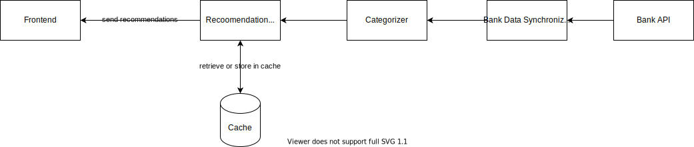

# Solution

## Step 1: Scope the Problem

We need to design a personal financial manager. We will connect it to our bank accounts, it will analyze our spending habits and make recommendations.

Before we dive in we need to understand multiple things

1. Are we planning the design of the entire system? frontend to backend?
2. What features are we actually need?
3. What kind of recommendations should we supply?
4. Should the data be updated at real time or at the end of some period, say day / week / month?
5. Is the system write-heavy or read-heavy?
6. Do we need any permanent storage?

## Step 2: Make Reasonable Assumptions

For the above list, we'll make the following assumptions

1. Yes, we are planning the entire system (from an eagle view)
2. We need to show the user _how_ he spent his money, and recommendations on how to save more
3. We should supply recommendations based on user transaction history and notify them
4. The data should be updated once a day
5. The system will be _write-heavy_
6. We might not need permanent storage

## Step 3: Draw the Major Components

## Step 4: Identify the Key Issues

_Recommendations Might be Expensive_

Analyzing user's spending habits and generating recommendations out of it will probably be expensive. We assumed these recommendations will be good for at least 24 hours.  
Therefore, when a user enters the application, we first check if there are any cached recommendations, if there aren't we will ask the required information from the bank api, generate recommendations and store them in cache. Otherwise, if there are cached results, send them.

_Recommendations Cache Should be Purged_

Since recommendations are good for 24 hours, we should purge them after 24 hours. We can run a process periodically to check the age of the recommendations and clear them.
