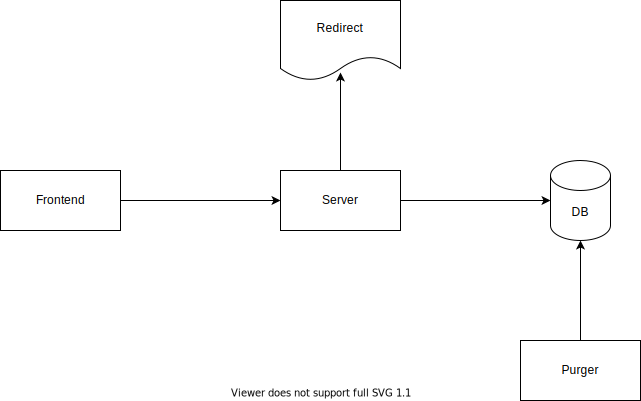

# Solution

## Step 1: Scope the Problem

We need to deign a system where a user enter text and get a random url to access it. We need to better understand what we are building

1. Does the user can enter anything besides the content, for example the webpage title?
2. Does the content has size limit?
3. How long should the urls exist?
4. If the urls has time to live, should we renew their time to live when user access a url?
5. Do we use single machine or multiple machines?
6. Can we update data?
7. Is this write-heavy or read-heavy system?

## Step 2: Make Reasonable Assumptions

For the above questions we'll make the following assumptions

1. Yes, the user can enter the content and a page title
2. Yes, it cannot be larger then 10mb
3. As long as users access them, and if they are not inactive for 1 week
4. Design for multiple machines
5. Data cannot be updated
6. This is read-heavy system

## Step 3: Draw the Major Components

Given the above information the basic architecture should consist of a frontend to create new short urls, a server and a DB.
We'll also need some service to purge stale data.

## Step 4: Identify Key Issues

_Reduce DB Access_

Since this is read-heavy system, we don't want that every request will equal to db query. What we can do is to cache the most frequently accessed urls and reduce calls to the db.

_Size of Data Exceeds DB Capability_

What if we have so much data that we don't have enough space in our DB? we can, for example, when we insert a url to check if we are close to the database limit. If so we need to run some sort of LRU cache and purge the entry that wasn't accessed for the longest time.
